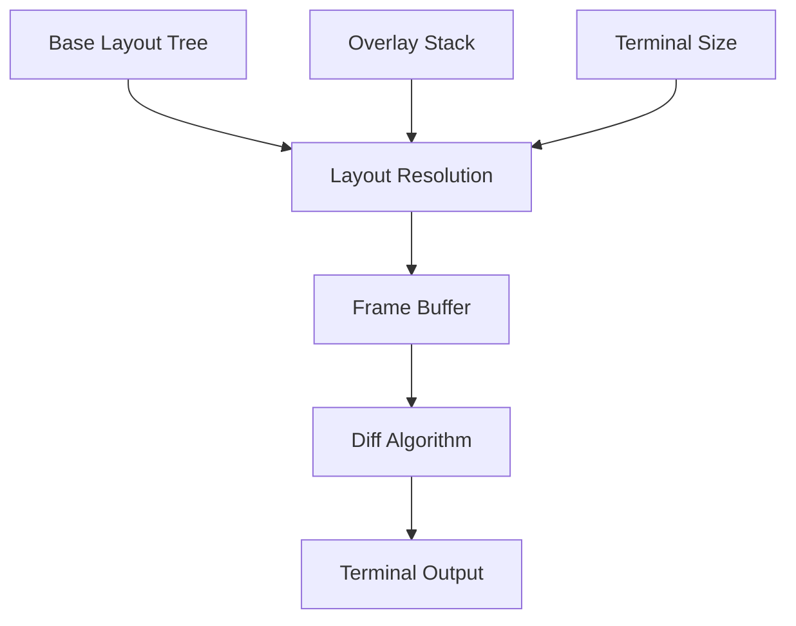
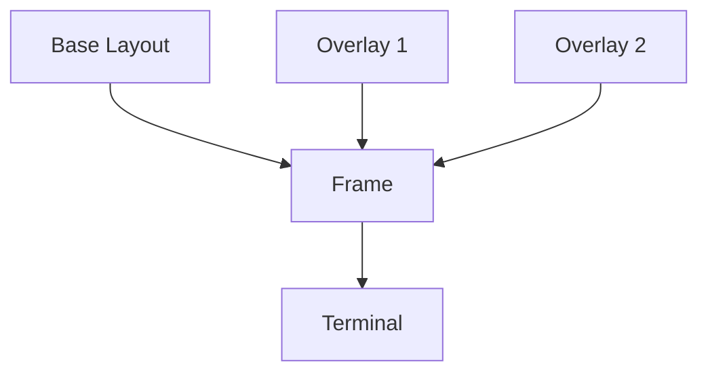
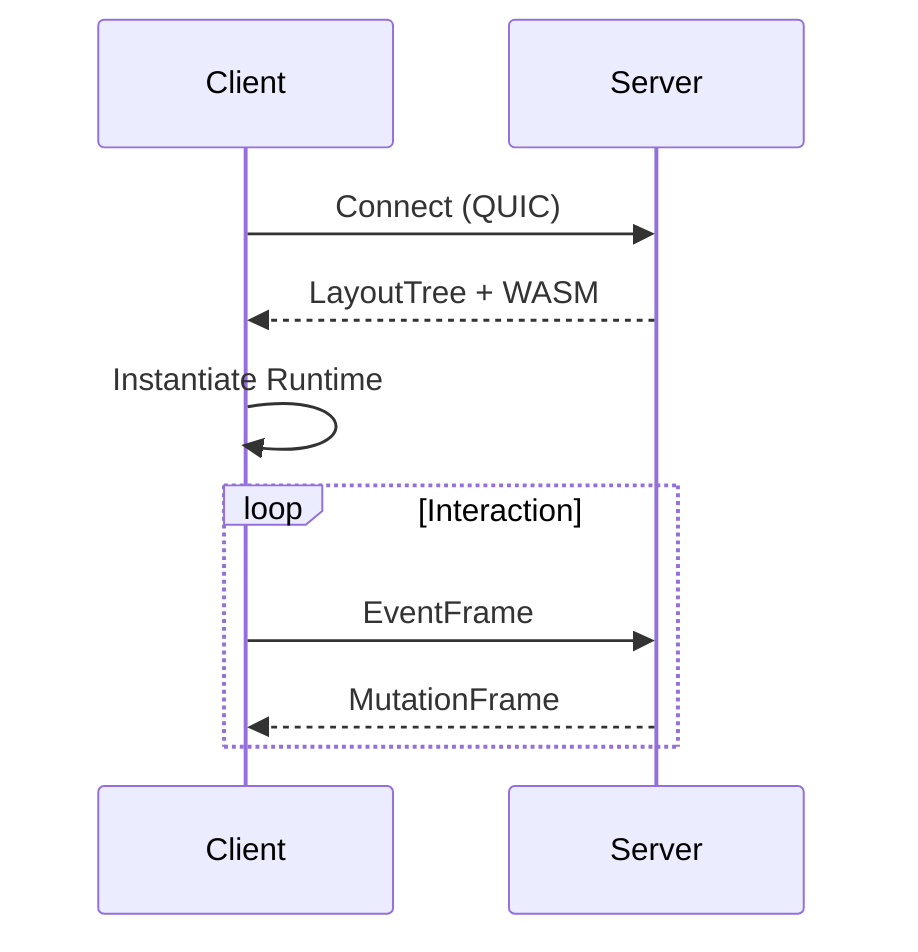

# RDTR Architecture Overview

```mermaid
flowchart LR
    Server -->|Binary Protocol (QUIC)| Engine
    Engine --> LayoutResolver
    Engine --> OverlayStack
    Engine --> WasmRuntime

    WasmRuntime -->|MutationOps| Engine
    LayoutResolver --> FrameBuffer
    OverlayStack --> FrameBuffer

    FrameBuffer --> DiffEngine
    DiffEngine --> Terminal
```

### Description

- Server sends layout + WASM
- WASM produces validated mutation operations
- Engine resolves layout deterministically
- Overlay stack applied
- Frame buffer generated
- Diff engine computes minimal terminal updates

---

## 1.2 Rendering Pipeline

`docs/diagrams/render-pipeline.md`

# Rendering Pipeline



All mutations must pass through the engine validator.

---

## 1.4 Overlay Stack Model

`docs/diagrams/overlay-stack.md`

```md
# Overlay Stack Model



Overlay resolution rules:

- Stack-based
- Topmost overlay receives focus
- Geometry computed by engine

---

## 1.5 Binary Protocol Lifecycle

`docs/diagrams/protocol-lifecycle.md`

```md
# Protocol Lifecycle


